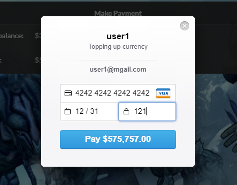

# Welcome to ShareID Documentation

##### Here we included the all the features and documented them in details. As we have not deployed this project yet, this project needs to be run on local machine. Node needs to be installed on the machine and  after downloading the project run the following commands in command prompt to start the project. 
* `npm install` - Installs all dependency.
* `node app` - Start the project server.

## Tools that we have used in this project

* Frontend
    - ejs
    - Semantic UI
    - Javascript

* Backend
    - Node.js
    - Express.js
    - MySql

# Payment Feature
* In this feature an user is able to pay with stripe payment gateway. This feature was developed by Ridoan Ahmed Arnob (ID: 011181011).

## Codes for this features
### Routes
    
    //setting up express and routing app
    const express = require("express");
    const router = express.Router();

    //getting the controllers
    const paymentController = require("../controllers/paymentController.js");

    router.get("/pay-form", paymentController.showPayForm);
    router.get("/payform-info", paymentController.getFormInfo)
    router.post("/pay", paymentController.pay);
    router.post("/payment", paymentController.payment);

    module.exports = router;

### Controller

    //including model
    const paymentModel = require("../models/paymentModel.js");

    //including helpers
    const {id} = require("../helpers/activeUser.js");
    const {Publishable_Key, stripe} = require("../helpers/stripeConfig.js");

    let showPayForm = async (req, res)=>{

        let userID = id;
        // let currentAmount = await paymentModel.getCurrency(userID);
        let title = "payment";
        let data = {
            pageTitle : title,
            // currentAmount
        }
        res.render("pay-form", {data});

    }

    let getFormInfo = async (req, res)=>{

        let userID = id;
        let currentAmount = await paymentModel.getCurrency(userID);
        let data = {
            currentAmount
        }
        res.json({data});

    }

    let pay = async (req, res)=>{

        let userID = id;
        let amount = req.body.amount;
        let userInfo =  await paymentModel.getUserInfo(userID);
        // console.log(userInfo)
        let email = userInfo[0].user_email;
        let name = userInfo[0].user_name;
        let currentAmount = await paymentModel.getCurrency(userID);

        let title = "payment";
        let data = {
            pageTitle : title,
            key: Publishable_Key,
            amount,
            email,
            name,
            currentAmount
        }
        res.render("pay", {data});

    }

    let payment = async (req, res) => { 

        let userID = id;
        // console.log(req.body);
        
        let amount = req.body.amount;
        let paidAmount = parseInt(amount, 10);
        let userInfo =  await paymentModel.getUserInfo(userID);
        // let email = req.body.email;
        let name = userInfo[0].user_name;
        let description = "Topping up currency";

        
        stripe.customers.create({ 
            email: req.body.stripeEmail, 
            source: req.body.stripeToken, 
            name, 
            
        }) 
        .then((customer) => { 

            // console.log("The customer id is " + customer.id);
            return stripe.charges.create({ 
                amount: amount * 100,     
                description, 
                currency: 'USD', 
                customer: customer.id 
                
            }); 
        }) 
        .then( async (charge) => { 
            // console.log("The charge is ");
            // console.log(charge);
            // res.send("Success") // If no error occurs
            let currentAmount = await paymentModel.getCurrency(userID);
            let totalAmount = currentAmount + paidAmount;
            // console.log(totalAmount);
            await  paymentModel.updateCurrency(userID, totalAmount);
            await  paymentModel.paymentDetails(userID, paidAmount);
            res.redirect("/pay-form")
        }) 
        .catch((err) => { 
            res.send(err)    // If some error occurs 
        }); 
    }

    module.exports = {
        showPayForm,
        getFormInfo,
        pay,
        payment,
    }

### Models

    let { query } = require("../helpers/db.js");

    let getUserInfo = async (userID) =>{
        let sqlCommand = `SELECT user_id, user_name, user_email FROM user_login_info WHERE user_id = ${userID};`
        let result = await query(sqlCommand);
        return result;
    }

    let getCurrency = async (userID) =>{
        let sqlCommand = `SELECT currency FROM user_info WHERE user_id = ${userID};`
        let result = await query(sqlCommand);

        return parseInt(result[0].currency, 10);
    }

    let updateCurrency = async (userID, amount) =>{
        let sqlCommand = `UPDATE user_info SET currency = ${amount} WHERE user_id = ${userID};`
        let result = await query(sqlCommand);

        return result;
    }

    let paymentDetails = async (userID, amount) =>{
        let sqlCommand = `SELECT COUNT(*) AS c FROM payment_details WHERE user_id = ${userID};`;
        let result = await query(sqlCommand);
        let count = result[0].c + 1;
        sqlCommand = `INSERT INTO payment_details(id, user_id, pay_amount, pay_time) VALUES (${count}, ${userID}, ${amount}, CURRENT_TIMESTAMP)`;
        result = await query(sqlCommand);
        return result;
    }

    module.exports = {
        getUserInfo,
        getCurrency,
        updateCurrency,
        paymentDetails
    }

## How to use the feature
* The feature can be used by following steps
    1. Click on the dropdown menu in navigation Bar.
    > 
    2. Select Payment.
    > 
    3. Enter amount in payment form.
    > 
    4. Click on the pay with card button
    > 
    5. Fill out the form and pay the amount
    >  

## Problems faced
* In this project The only problem I faces was is installing mkdocs using python 3.9 . Mkdocs was not being installed in python version 3.9

