# Welcome to ShareID Documentation

##### Here we included the all the features and documented them in details. As we have not deployed this project yet, this project needs to be run on local machine. Node needs to be installed on the machine and  after downloading the project run the following commands in command prompt to start the project. 
* `npm install` - Installs all dependency.
* `node app` - Start the project server.

## Tools that we have used in this project

* Frontend
    - ejs
    - Semantic UI
    - Javascript

* Backend
    - Node.js
    - Express.js
    - MySql

# Payment Feature
* In this feature an user is able to pay with stripe payment gateway. This feature was developed by Ridoan Ahmed Arnob (ID: 011181011).

## Codes for this features
### Routes
    
    //setting up express and routing app
    const express = require("express");
    const router = express.Router();

    //getting the controllers
    const paymentController = require("../controllers/paymentController.js");

    router.get("/pay-form", paymentController.showPayForm);
    router.get("/payform-info", paymentController.getFormInfo)
    router.post("/pay", paymentController.pay);
    router.post("/payment", paymentController.payment);

    module.exports = router;

### Controller

    //including model
    const paymentModel = require("../models/paymentModel.js");

    //including helpers
    const {id} = require("../helpers/activeUser.js");
    const {Publishable_Key, stripe} = require("../helpers/stripeConfig.js");

    let showPayForm = async (req, res)=>{

        let userID = id;
        // let currentAmount = await paymentModel.getCurrency(userID);
        let title = "payment";
        let data = {
            pageTitle : title,
            // currentAmount
        }
        res.render("pay-form", {data});

    }

    let getFormInfo = async (req, res)=>{

        let userID = id;
        let currentAmount = await paymentModel.getCurrency(userID);
        let data = {
            currentAmount
        }
        res.json({data});

    }

    let pay = async (req, res)=>{

        let userID = id;
        let amount = req.body.amount;
        let userInfo =  await paymentModel.getUserInfo(userID);
        // console.log(userInfo)
        let email = userInfo[0].user_email;
        let name = userInfo[0].user_name;
        let currentAmount = await paymentModel.getCurrency(userID);

        let title = "payment";
        let data = {
            pageTitle : title,
            key: Publishable_Key,
            amount,
            email,
            name,
            currentAmount
        }
        res.render("pay", {data});

    }

    let payment = async (req, res) => { 

        let userID = id;
        // console.log(req.body);
        
        let amount = req.body.amount;
        let paidAmount = parseInt(amount, 10);
        let userInfo =  await paymentModel.getUserInfo(userID);
        // let email = req.body.email;
        let name = userInfo[0].user_name;
        let description = "Topping up currency";

        
        stripe.customers.create({ 
            email: req.body.stripeEmail, 
            source: req.body.stripeToken, 
            name, 
            
        }) 
        .then((customer) => { 

            // console.log("The customer id is " + customer.id);
            return stripe.charges.create({ 
                amount: amount * 100,     
                description, 
                currency: 'USD', 
                customer: customer.id 
                
            }); 
        }) 
        .then( async (charge) => { 
            // console.log("The charge is ");
            // console.log(charge);
            // res.send("Success") // If no error occurs
            let currentAmount = await paymentModel.getCurrency(userID);
            let totalAmount = currentAmount + paidAmount;
            // console.log(totalAmount);
            await  paymentModel.updateCurrency(userID, totalAmount);
            await  paymentModel.paymentDetails(userID, paidAmount);
            res.redirect("/pay-form")
        }) 
        .catch((err) => { 
            res.send(err)    // If some error occurs 
        }); 
    }

    module.exports = {
        showPayForm,
        getFormInfo,
        pay,
        payment,
    }

### Models

    let { query } = require("../helpers/db.js");

    let getUserInfo = async (userID) =>{
        let sqlCommand = `SELECT user_id, user_name, user_email FROM user_login_info WHERE user_id = ${userID};`
        let result = await query(sqlCommand);
        return result;
    }

    let getCurrency = async (userID) =>{
        let sqlCommand = `SELECT currency FROM user_info WHERE user_id = ${userID};`
        let result = await query(sqlCommand);

        return parseInt(result[0].currency, 10);
    }

    let updateCurrency = async (userID, amount) =>{
        let sqlCommand = `UPDATE user_info SET currency = ${amount} WHERE user_id = ${userID};`
        let result = await query(sqlCommand);

        return result;
    }

    let paymentDetails = async (userID, amount) =>{
        let sqlCommand = `SELECT COUNT(*) AS c FROM payment_details WHERE user_id = ${userID};`;
        let result = await query(sqlCommand);
        let count = result[0].c + 1;
        sqlCommand = `INSERT INTO payment_details(id, user_id, pay_amount, pay_time) VALUES (${count}, ${userID}, ${amount}, CURRENT_TIMESTAMP)`;
        result = await query(sqlCommand);
        return result;
    }

    module.exports = {
        getUserInfo,
        getCurrency,
        updateCurrency,
        paymentDetails
    }

## How to use the feature
* The feature can be used by following steps
    1. Click on the dropdown menu in navigation Bar.
    > 
    2. Select Payment.
    > 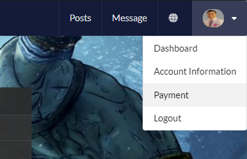
    3. Enter amount in payment form.
    > 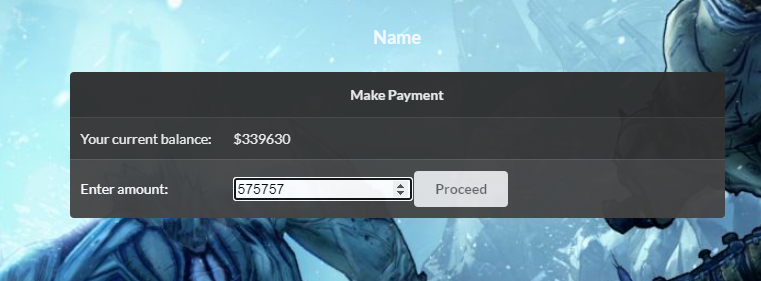
    4. Click on the pay with card button
    > 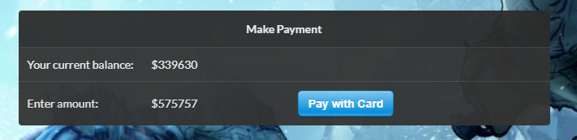
    5. Fill out the form and pay the amount
    > 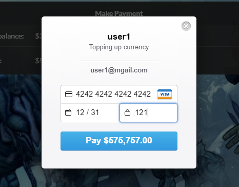 

## Problems faced
* In this project The only problem I faces was is installing mkdocs using python 3.9 . Mkdocs was not being installed in python version 3.9

# Search Feature
* In this feature an user is able to search . This feature was developed by Al-Amin (ID: 011181003).

## Codes for this features
### Routes
    
    //setting up express and routing app
    const express = require("express");
    const router = express.Router();

    //getting the search
    const searchController = require("../controllers/searchController.js");
    router.post("/search",searchController.search)

    module.exports = router;

### Controller

    const searchModel = require("../models/searchModel.js");

    let search = async (req , res)=>
    {
        console.log(req.body);
        // let category = req.body.cat;
        let searchQuery = req.body.q;
        let searchresult = await searchModel.getSearchedPosts(searchQuery);
        let pageTitle = "searchResult";
        let data = {
        pageTitle,
        searchresult
        };
        res.render("search-results.ejs" , { data });
    }

    module.exports =
    {
    search 
    }

### Models

    let { query } = require("../helpers/db.js");

    let getSearchedPosts = async (searchQuery) =>
    {
        let sqlCommand = ` SELECT * FROM post_details WHERE title LIKE '%${searchQuery}%'`
        // let sqlCommand = `SELECT * FROM user_login_info WHERE 1;`
        let result = await query(sqlCommand);
        console.log(result);
        return result;
    }

    module.exports = 
    {
    getSearchedPosts

    }

## How to use the feature
* The feature can be used by following steps
    1. Click on the search bar.
    > 
    2. Give desire query to search.
    > 
    3. Enter search button.
    > 
    4. Then get the search result.
    > 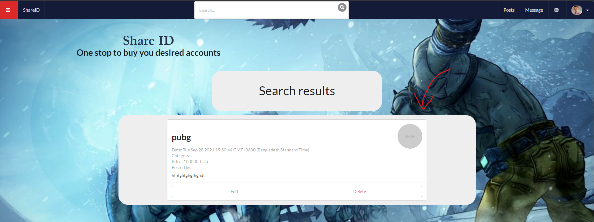

# Payment notification Feature
* In this feature an user get payment notification in navigation bar . This feature was developed by Al-Amin (ID: 011181003).

## Codes for this features
### Routes
    
    const express = require("express");
    const router = express.Router();

    //getting the notification
    const notificationController = require("../controllers/notificationController.js");
    router.get("/notification",notificationController.getNotification);

    module.exports = router;

### Controller

    const notificationModel = require("../models/notificationModel.js");
    const {id} = require("../helpers/activeUser.js");
    let getNotification = async (req , res)=>
    {

        let notificationID= id;
        let notificationresult = await notificationModel.getNotification(notificationID);
        let data ={notificationresult} ;
        // res.render("navbar.ejs" , { data });
        res.json({data});
    }

    module.exports =
    {
    getNotification 
    }

### Models

    let { query } = require("../helpers/db.js");

    let getNotification = async (userID) =>{
    let sqlCommand = `SELECT * FROM notification WHERE user_id = ${userID};`
    let result = await query(sqlCommand);
    return result;
    }

    module.exports = {
    getNotification
    }

## How to use the feature
* The feature can be used by following steps
    1. After successfull payment.
    > 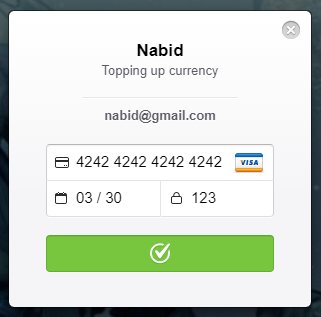
    2. Payment notification in the navigation bar.
    > 

## Problems faced
* In this project I was supposed to implement elastic search but could not synchronize elastic search with mysql database.

# Account information Feature
* In this feature an user can show their information and other can view their information. This feature was developed by Azizul Hakim (ID: 011181149).

## Codes for this features
### Routes
    
    //setting up express and routing app
    const express = require("express");
    const router = express.Router();

    //getting the authentication controller
    const accountInfoController = require("../../controllers/profileController/accountInfoController.js");

    router.get("/account-info", accountInfoController.accountInfo);
    router.post("/account-info", accountInfoController.info);
    router.get("/account-info", accountInfoController.showInfo)

    module.exports = router;

### Controller

    //requiring models
    const accountInfoModel = require("../../models/profileModel/accountInfoModel.js");
    const { id } = require("../../helpers/activeUser");

    let accountInfo = async (req, res) =>{
        let activeUser = id; 
        let showUserInfo = await accountInfoModel.showInfo(activeUser);
        
        let pageTitle = "Account-Information";
        let data = {
            pageTitle,
            showUserInfo
        }
        console.log(data.showUserInfo);
        var resultArray = Object.values(JSON.parse(JSON.stringify(data.showUserInfo)))

        console.log(resultArray);
        res.render("account-info.ejs", {data});
    }

    let info = async (req, res) =>{
        
        let FirstName = req.body.fName;
        let LastName = req.body.lName;
        let dob = req.body.dob;
        let phone = req.body.phone;
        let activeUser = id; 
        console.log(req.body);

        await accountInfoModel.createInfo(activeUser, FirstName, LastName, dob, phone);
        res.redirect("/account-info");
        
    }

    let showInfo = async (req, res) =>{
        
        let activeUser = id; 
        console.log(req.body);
        let showUserInfo = await accountInfoModel.showInfo(activeUser);
        console.log(showUserInfo);
        let pageTitle = "Account-Information";
        let data = {
            pageTitle
        }

        res.render("account-info.ejs", {data});
    }

    module.exports = {
        accountInfo,
        info,
        showInfo
    }

### Models

    let { query } = require("../../helpers/db.js");

    let createInfo = async (activeUser, fName, lName, dob, phone) => {
        console.log(activeUser, fName, lName, dob, phone);
        
        let sqlCommand = `INSERT INTO user_info( user_id, first_name, last_name, dob, phone, currency) VALUES (${activeUser}, '${fName}', '${lName}', '${dob}', '${phone}', '');`

        let result = await query(sqlCommand);
        console.log(result);
        return result;

    }

    let showInfo = async (activeUser) => {
        
        let sqlCommand = `SELECT user_id, first_name, last_name, dob, phone, currency FROM user_info WHERE user_id = '${activeUser}';`

        let result = await query(sqlCommand);
        return result;
    }

    // let find = async (fName) => {
        
    //     let sqlCommand = `SELECT * FROM user_login_info WHERE user_name = "${fName}";`
        
    //     let result = await query(sqlCommand);
    //     return result;
    // } 

    module.exports = {
        createInfo,
        showInfo
        
    }

## How to use the feature
* The feature can be used by following steps
    1. Click on the dropdown menu in navigation Bar.
    > 
    2. Select account information.
    > 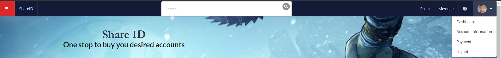
    3. All account information.
    > 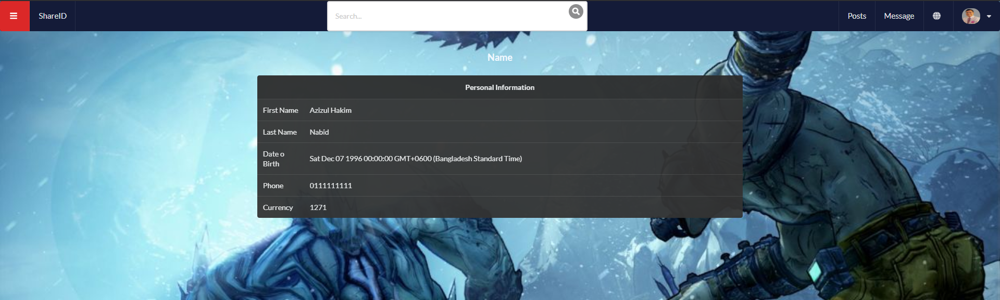

# Dashboard Feature
* This feature helps to view the over-all information of a user. This feature was developed by Azizul Hakim (ID: 011181149).

## Codes for this features
### Routes
    
    //setting up express and routing app
    const express = require("express");
    const router = express.Router();

    //getting the authentication controller
    const dashboardController = require("../../controllers/profileController/dashboardController.js");

    router.get("/dashboard", dashboardController.dashboardData);
    router.get("/dashboard-data", dashboardController.dashboardAjaxData);

    module.exports = router;

### Controller

    //requiring models
    const dashboardModel = require("../../models/profileModel/dashboardModel.js");
    const { id } = require("../../helpers/activeUser");

    let dashboardData = async (req, res) =>{
        let activeUser = id; 
        let dashboardEarned = await dashboardModel.showEarned(activeUser);
        let dashboardPaid = await dashboardModel.showPaid(activeUser);
        let dashboardTotalPost = await dashboardModel.showTotalpost(activeUser);
        // console.log(dashboardData.length);
        let pageTitle = "Dashboard";
        let data = {
            pageTitle,
            dashboardEarned,
            dashboardPaid,
            dashboardTotalPost

        }
        console.log("data 1" + data);
        res.render("dashboard.ejs", {data});
    }

    let dashboardAjaxData = async (req, res) =>{
        // console.log("data 2" + data);

        let activeUser = id; 
        let dashboardCurrency = await dashboardModel.showCurrency(activeUser);
        let data = {
            dashboardCurrency
        }
        // console.log("data 2" + data);
        console.log(data);
        res.json({data});
    }

    module.exports = {
        dashboardData,
        dashboardAjaxData
    
    }

### Models

    let { query } = require("../../helpers/db.js");

    let showCurrency = async (activeUser) => {
        let sqlCommand = `SELECT currency FROM user_info WHERE user_id = '${activeUser}';`
        let result = await query(sqlCommand);
        return result;
    }
    let showEarned = async (activeUser) => {
        let sqlCommand = `SELECT SUM(pay_amount) as earn FROM transaction_history WHERE seller_id = '${activeUser}';`
        let result = await query(sqlCommand);
        return result;
    }
    let showPaid = async (activeUser) => {
        let sqlCommand = `SELECT SUM(pay_amount) as pay FROM transaction_history WHERE buyer_id = '${activeUser}';`
        let result = await query(sqlCommand);
        return result;
    }
    let showTotalpost = async (activeUser) => {
        let sqlCommand = `SELECT MAX(pid) as totalPost FROM post_details WHERE user_id = '${activeUser}';`
        let result = await query(sqlCommand);
        return result;
    }

    module.exports = {
        showCurrency,
        showEarned,
        showPaid,
        showTotalpost

        
    }

## How to use the feature
* The feature can be used by following steps
    1. Click on the dropdown menu in navigation Bar.
    > 
    2. Select Dashboard.
    > 
    3. All dashboard information.
    > 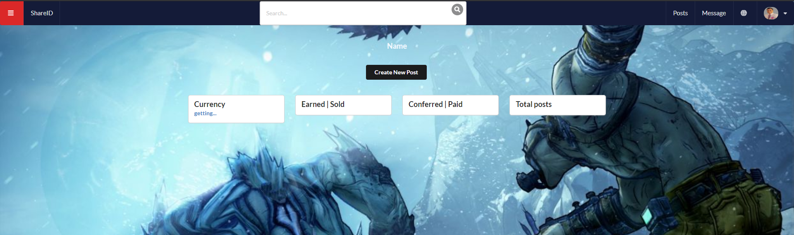
## Problems faced
* In this project I faced database query issues.

# Post management Feature
* This feature helps to view the over-all information of a user. This feature was developed by Azizul Hakim (ID: 011181149).

## Codes for this features
### Routes
    //setting up express and routing app
    const express = require("express");
    const router = express.Router();

    //getting the createpost
    const postController = require("../controllers/postController.js");

    router.get("/createpost", postController.createpost);
    router.post("/createpost",postController.createpostUser)
    router.get("/latest-posts", postController.showLatestPost)
    router.get("/editpost/:id", postController.editpost)
    router.post("/editpost/:id", postController.editpostUser)
    router.get('/deletepost/:id',postController.deletepost)
    module.exports = router;

### Controller

    let { id } = require("../helpers/activeUser.js");
    const postModel = require("../models/postModel.js");

    let createpost = (req , res)=>
    {

        let pageTitle = "CreatePost";
        let data =
        {
            pageTitle
        }
        res.render("createpost.ejs" , { data });
    }

    let createpostUser = async (req , res)=>
    {
        let activeUser = id;
        let title = req.body.title;
        let category = req.body.category;
        let price = req.body.price;
        let username = req.body.username;
        let pass = req.body.pass;
        let description = req.body.description;
        let tags = req.body.tags;
        let postStatus = "unsold";

        // console.log("the id is" + activeUser);
        let  postCount = await postModel.getPostCount(activeUser);
    
        postCount = postCount[0].c;
        postCount++;
        let pid = postCount;
        //console.log("the post count is" + postCount);
        postModel.createpostUser(pid, activeUser, title, category, price, username, pass, description, tags, postStatus)

        let pageTitle = "CreatePost";
        let data = 
        {
            pageTitle
        }
        res.render("createpost.ejs" , {data});
    }

    let editpost = async(req , res)=>
    {
        let pageTitle = "EditPost";
        let post = await postModel.getPost(req.params.id);
        let data =
        {
            pageTitle,
            post
        }
        res.render("editpost.ejs" , { data });
    }

    let editpostUser = async (req , res)=>
    {
        console.log(req.params.id);
        console.log(req.body);
        let pid = req.params.id
        let title = req.body.title;
        let category = req.body.category;
        let price = req.body.price;
        let username = req.body.username;
        let description = req.body.description;
        let tags = req.body.tags;
        postModel.editpostUser(pid,title, category, price, username,description, tags)
        res.redirect('/latest-posts')
    }

    let showLatestPost = async (req , res)=>
    {
        let activeUser = id;
        let posts = await postModel.getAllPosts(activeUser);
        let pageTitle = "Posts";
        let data = 
        {
            pageTitle,
            posts
        }
        res.render("latest-posts.ejs" , { data });
    } 

    let deletepost = async (req , res)=>
    {
        console.log('DeleteId',req.params.id);
        let pid = req.params.id
        postModel.deletepost(pid)
        res.redirect('/')

    } 

    module.exports =
    {
        createpost,
        createpostUser,
        showLatestPost,
        editpost, 
        editpostUser,
        deletepost
    }

### Models

    let { query } = require("../helpers/db.js");

    let createpostUser = async (pid, activeUser, title, category, price, username, pass, description, tags, postStatus) => 
    {
        let sqlCommand = `INSERT INTO post_details(pid, user_id, title, description, puser_name, puser_pass, post_cat, post_status, post_time, price, tag)
        VALUES (${pid}, ${activeUser}, '${title}', '${description}', '${username}', '${pass}', ${category}, '${pid}', CURRENT_TIMESTAMP, ${price}, '${tags}');`;
        let result = await query(sqlCommand);
        console.log(result);
        return result;
    }

    let getPostCount = async (userID) =>
    {
        let sqlCommand = `SELECT COUNT(*) AS c FROM post_details WHERE user_id = ${ userID };`
        // let sqlCommand = `SELECT * FROM user_login_info WHERE 1;`
        let result = await query(sqlCommand);
        return result;
    }

    let getAllPosts = async (userID) =>
    {
        // let sqlCommand = ` SELECT pid, pd.user_id, title, description, puser_name, puser_pass, post_cat, post_status, post_time, price, tag cat_name, uli.user_name 
        // FROM post_details AS pd JOIN post_cat AS pc ON pd.pid = pc.cat_id JOIN user_login_info AS uli ON pd.user_id = uli.user_id WHERE pd.user_id = ${ userID } `
        let sqlCommand = `SELECT * FROM post_details WHERE user_id = ${ userID };`
        let result = await query(sqlCommand);
        return result;
    }

    let getUserAllPosts = async (userID) =>
    {
        // let sqlCommand = ` SELECT pid, pd.user_id, title, description, puser_name, puser_pass, post_cat, post_status, post_time, price, tag cat_name, uli.user_name 
        // FROM post_details AS pd JOIN post_cat AS pc ON pd.pid = pc.cat_id JOIN user_login_info AS uli ON pd.user_id = uli.user_id WHERE pd.user_id = ${ userID } `
        let sqlCommand = `SELECT * FROM post_details WHERE user_id != ${ userID };`
        let result = await query(sqlCommand);
        return result;
    }

    let getPost = async (postID) =>
    {
        let sqlCommand = `SELECT * FROM post_details WHERE pid = ${ postID };`
        let result = await query(sqlCommand);
        return result;
    }

    let editpostUser = async (pid,title, category, price, username,description, tags) => 
    {
        let sqlCommand = `UPDATE post_details SET title='${title}',description='${description}',puser_name='${username}',
        post_cat='${category}',price= ${price},post_time= CURRENT_TIMESTAMP,tag='${tags}' WHERE pid = ${pid}`;

        let result = await query(sqlCommand);
        console.log(result);
        return result;
    }

    let deletepost = async (postID) =>
    {
        let sqlCommand = `DELETE FROM post_details WHERE pid = ${postID}`
        let result = await query(sqlCommand);
        return result;
    }

    module.exports = 
    {
    createpostUser,
    getPostCount,
    getAllPosts,
    getPost,
    editpostUser,
    deletepost,
    getUserAllPosts

    }

## How to use the feature
* The feature can be used by following steps
    1. In the home latest-posts is showing.
    > 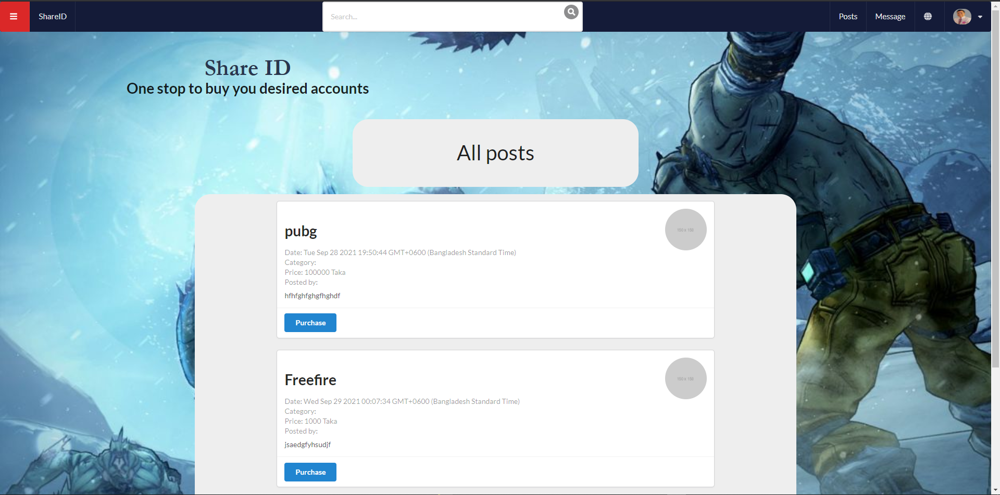
    2. Select post to see own post.
    > 
    3. Select craete post to craete new post.
    > 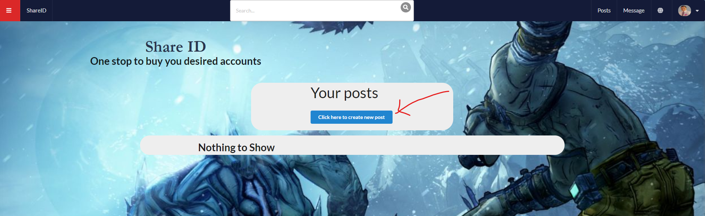
    1. Craete post form to craete new post.
    > 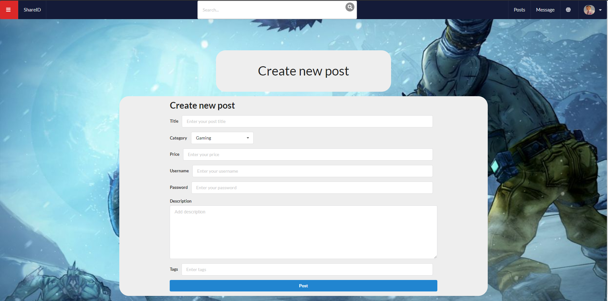
## Problems faced
* In this project I faced database connectivity problem.
* 
#  Messaging Feature
	This feature is created for communicating with each other.
    Two users can send and receive messages. 
    They can negotiate or discuss about the ID they want buy/ sell .

    Developed by Ashfia Ahmed Adiba, 
    ID- 011 161 128
## CODES FOR MESSAGING

## Routes

    //setting up express and routing app
    const express = require("express");
    const router = express.Router();

    let messageController = require("../controllers/messageController.js")

    router.get("/message", messageController.message);
    router.post("/message", messageController.messageUser)
    router.get("/viewmsguser", messageController.viewUser);
    router.get("/message-inbox", messageController.msgInbox);
    router.post("/message-inbox", messageController.insertMsg);

    module.exports = router;

## Controller

    let { query } = require("../helpers/db.js");

    let createMsg = async (activeUser,activeMsgCount, userId, userMsgCount) => {
        
        let sqlCommand = `INSERT INTO is_msg_created(msg_id, user_id, created_with_id)
        VALUES ('${activeMsgCount}','${activeUser}','${userId}');`
        let result = await query(sqlCommand);
        // return result;

        sqlCommand = `INSERT INTO is_msg_created(msg_id, user_id, created_with_id)
        VALUES ('${userMsgCount}','${userId}','${activeUser}');`
        result = await query(sqlCommand);
        return result;
    }
    let getMsgList = async (activeUser) => {
        
        // let sqlCommand = `SELECT imc.msg_id, imc.user_id, created_with_id, user_name, msg,
        //  msg_time FROM is_msg_created AS imc JOIN user_login_info AS uli ON uli.user_id = imc.created_with_id JOIN inbox ON inbox.sender_id 
        // WHERE imc.user_id = ${activeUser};`
        let sqlCommand = `SELECT imc.msg_id, imc.user_id, created_with_id, user_name FROM is_msg_created AS imc JOIN user_login_info AS uli ON uli.user_id = imc.created_with_id 
        WHERE imc.user_id = ${activeUser};`
        let result = await query(sqlCommand);
        return result;
    }
    let getUserList = async (activeUser) => {
        
        let sqlCommand = `SELECT user_id,user_name, user_email FROM user_login_info WHERE user_id != ${activeUser} && user_id != 1 ;;`
        let result = await query(sqlCommand);
        return result;
    }
    let getMsg = async (activeUser,msgWithID) => {
        
        let sqlCommand = `SELECT msg_id, sender_id, reciever_id, msg, msg_time FROM inbox WHERE (sender_id = ${activeUser} || sender_id = ${msgWithID}) AND (reciever_id = ${activeUser} || reciever_id = ${msgWithID});`
        let result = await query(sqlCommand);
        return result;
    }
    let checkIfMsgCreated = async (activeUser,msgWithID) => {
        
        let sqlCommand = `SELECT COUNT(*) AS c FROM is_msg_created WHERE user_id = ${activeUser} AND created_with_id = ${msgWithID};`
        let result = await query(sqlCommand);
        return result;
    }
    let getCreatedMsgCount = async (activeUser) => {
        
        let sqlCommand = `SELECT COUNT(*) AS c FROM is_msg_created WHERE user_id = ${activeUser};;`
        let result = await query(sqlCommand);
        return result;
    }

    let getMsgCount = async (activeUser,msgWithID) => {
        
        let sqlCommand = `SELECT COUNT(*) AS c FROM inbox WHERE (sender_id = ${activeUser} OR sender_id = ${msgWithID}) AND (reciever_id = ${activeUser} OR reciever_id = ${msgWithID});`
        let result = await query(sqlCommand);
        return result;
    }

    let insertMsg = async (msgID, activeUser, msgWithID, msg) => {
        console.log("The id is " + msgWithID)
        let sqlCommand = `INSERT INTO inbox(msg_id, sender_id, reciever_id, msg, msg_time) VALUES ('${msgID}', ${activeUser}, ${msgWithID}, '${msg}', CURRENT_TIMESTAMP);`
        let result = await query(sqlCommand);
        return result;
    }

    let getUserInfo =async (userID) => {
        
        let sqlCommand = `SELECT user_id, user_name FROM user_login_info WHERE user_id = ${userID};`
        let result = await query(sqlCommand);
        return result;
    }

    module.exports = {
        createMsg,
        getMsgList,
        getUserList,
        getMsg,
        checkIfMsgCreated,
        getCreatedMsgCount,
        getMsgCount,
        insertMsg,
        getUserInfo
        
    }

## Model

    const messageModel = require("../models/messageModel.js");

    const { id } = require("../helpers/activeUser");

    const df = require("dateformat");

    let message = async (req, res) =>{

        let activeUser = id;

        let msgList = await messageModel.

        getMsgList(activeUser);

        let pageTitle = "Message" ;

        let data = {
            pageTitle,
            msgList,
            df
        }

        res.render("messageList.ejs", {data});

    }

    let messageUser  = (req, res) =>{

        console.log(req,body) 
        

    }
    let viewUser = async (req, res) =>{

        let activeUser = id;

        let userList = await messageModel.
        getUserList(activeUser);

        let pageTitle = "User List" ;

        let data = {

            pageTitle,
            userList
        }

        res.render("user-newmsg-List.ejs", {data});

    }

    let msgInbox = async (req, res) =>{

        let activeUser = id;

        let msgWithID = req.query.uid;

        let msgCreated = await messageModel.checkIfMsgCreated(activeUser, msgWithID);

        if(msgCreated[0].c == 0){

            let msgCreateForActiveUser = await 
            messageModel.getCreatedMsgCount(activeUser);

            let msgCreateForUser = await messageModel.getCreatedMsgCount(activeUser);

            msgCreateForActiveUser = msgCreateForActiveUser[0].c + 1;

            msgCreateForUser = msgCreateForUser[0].c +1;

            await messageModel.createMsg(activeUser,msgCreateForActiveUser,msgWithID,msgCreateForUser);

        }

        console.log("The msg created length " + msgCreated.length);

        // console.log("The active user = " + activeUser);

        let msg = await messageModel.getMsg(activeUser,msgWithID);

        let activeUserInfo = await messageModel.getUserInfo(activeUser);

        let msgWithInfo = await messageModel.getUserInfo(msgWithID);

        // console.log(activeUserInfo[0].user_name);

        let pageTitle = "User List" ;

        let data = {
            
            pageTitle,
            msg,
            activeUserInfo,
            msgWithInfo,
            df
        }

        res.render("message.ejs", {data});
    }

    let insertMsg = async (req, res) =>{

        let activeUser = id;

        let msgWithID = req.body.uid;

        let msg = req.body.msg;

        // console.log("The id is " + msgWithID);

        let msgCount = await messageModel.getMsgCount(activeUser, msgWithID);

        msgCount = msgCount[0].c + 1;

        await messageModel.insertMsg(msgCount, activeUser, msgWithID, msg);
        
        res.redirect(`/message-inbox?uid=${msgWithID}`);
    }

    module.exports = {
        message,
        messageUser,
        viewUser,
        msgInbox,
        insertMsg
    }

## How to use the feature
* The feature can be used by following steps
	1. Only using two steps messaging feature can be performed by the user.
    2. After login users are at homepage, user can navigate to messaging page from the homepage by using message button. 
    3. Messaging page contains the list of messages sent or received by the user. 
    4. One user can send message to another user by clicking on user message list.

## Problem I faced    

As this project is done using Javascript, I had to learn Javascript from the very beggining. So, I faced difficulties while doing codes.